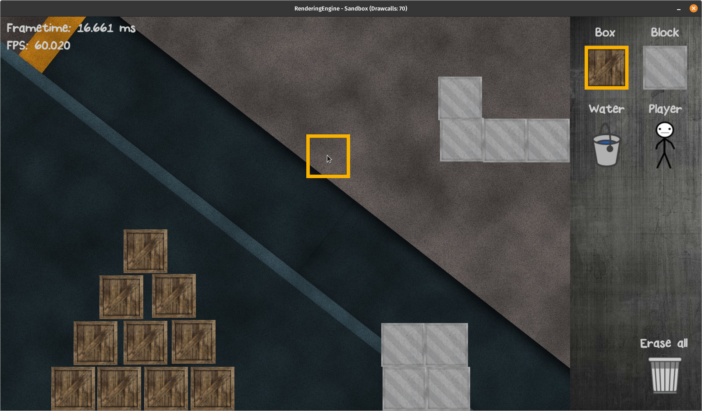

# RenderingEngine in C with OpenGL

#### Objectives:
   - Simple OpenGL-Wrapper functions with example implementations on how to integrate them
      - Located in the engine-core
      - "Sandbox" is such an example application using the engine-core  
   - Written entirely in C
      - It really should be 100% C-Code -> sometimes github detects C++ files for whatever reason

#### Planned functionalities
   - Basic OpenGL-Wrapping (VAO, VBO, IBO, Shader, Texture, Errorhandling)   
   - Windowcreation and monitoring (X)
   - 2D Sprite-Renderer (X)
   - Text rendering (X)
   - Sandbox level
      - GUI (X)
      - Box picking and placing (X)
      - Instanced rendering (X)
      - Physics
      - Liquids   
      - AI   

#### Credits
   - [SDL2](https://www.libsdl.org/index.php)
   - [log.c](https://github.com/rxi/log.c)
   - [stb_image](https://github.com/nothings/stb/blob/master/stb_image.h)
   - [cglm](https://github.com/recp/cglm)
   - [glad](https://github.com/Dav1dde/glad)
   - [freetype](https://freetype.org/index.html)
    
#### Using & Compiling
   - Clone the repository, install the dependencies (SDL2, cglm, freetype) and execute the Makefile
   - There will be a guide on how to build the whole engine when it's a bit more matured

#### License
   - This code is provided under a BSD-style license. See the file LICENSE for details

#### Structure 
   - Just for organisation purposes, not UML conform    

   

#### Current look of the sandbox level
   