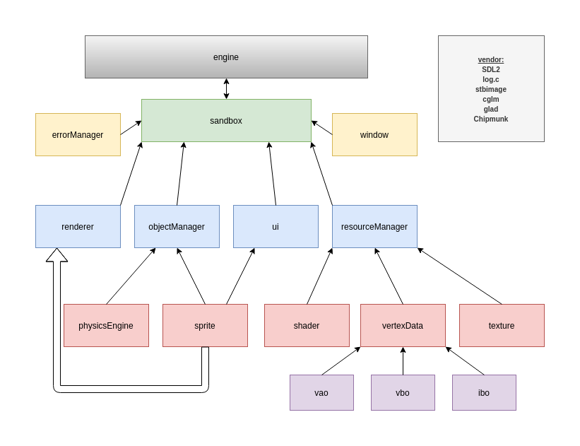
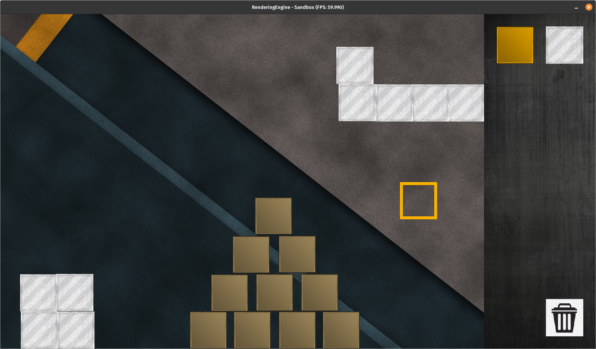

# RenderingEngine in C with OpenGL

#### Objectives:
   - Simple OpenGL-Wrapper functions
   - Written entirely in C
      - It really should be 100% C-Code -> github detects some C++ files for whatever reason

#### Planned functionalities   
   - 2D Sprite-Renderer
   - GUI
   - Graph- and pointrendering
   - Sandbox mode
      - Box picking and placing
      - Physics
      - Liquids      

#### Credits
   - [SDL2](https://www.libsdl.org/index.php)
   - [log.c](https://github.com/rxi/log.c)
   - [stb_image](https://github.com/nothings/stb/blob/master/stb_image.h)
   - [cglm](https://github.com/recp/cglm)
   - [glad](https://github.com/Dav1dde/glad)
    
#### Using & Compiling
   - Clone the repository, install the dependencies (SDL2, cglm) and execute the Makefile

#### License
   - This code is provided under a BSD-style license. See the file LICENSE for details

#### Structure of the application  
   - Just for organisation purposes, not UML conform    

   

#### Current look of the application
   