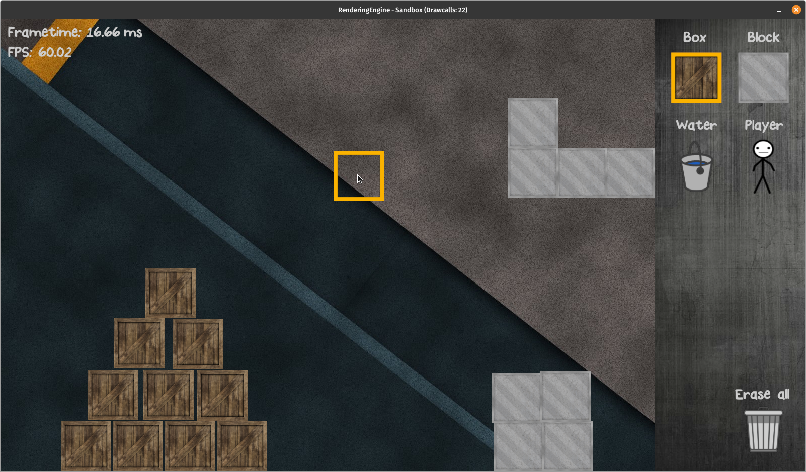

# RenderingEngine in C with OpenGL

### Objectives:
   - Simple OpenGL-Wrapper functions
      - Located in the engine-core
   - Example applications to show how use the wrapper functions       
      - Sandbox: Box-Picker (2D)
      - WrathGL: Third-person shooter (3D)  
   - Written entirely in C
      - It really should be 100% C-Code -> sometimes github detects C++ files for whatever reason

### Planned functionalities
   - Basic OpenGL-Wrapping (VAO, VBO, IBO, Shader, Texture, Errorhandling)  (X)  
   - Windowcreation for 2D and 3D (X)
   - 2D Sprite-Renderer (X)
   - Text rendering (X)
      - Batch rendering system (X)
   - OBJ-Loading
   - Camerasystem (Third-person)
   - Audiomanager for sounds and backgroundmusic        

### Example applications   
   #### Sandbox App
      - GUI (X)
      - Box picking and placing (X)
         - Instanced rendering (X)
      - 2D Physics (X)
      - Liquids   
      - AI
   #### WrathGL App            
      - 3D Mesh creation (planes, tiles) 
      - Player
      - Animation
      - Bots

### Credits
   - [SDL2](https://www.libsdl.org/index.php)
   - [log.c](https://github.com/rxi/log.c)
   - [stb_image](https://github.com/nothings/stb/blob/master/stb_image.h)
   - [cglm](https://github.com/recp/cglm)
   - [glad](https://github.com/Dav1dde/glad)
   - [FreeType](https://freetype.org/index.html)
   - [Chipmunk2D](https://github.com/slembcke/Chipmunk2D)
   - [GLFW](https://github.com/glfw/glfw) 

### Using & Compiling
   - Clone the repository, install the dependencies (SDL2, cglm, FreeType, Chipmunk2D, GLFW) and execture one of the shell scripts or the Makefile itself
   - There will be a guide on how to build the whole engine when it's a bit more matured

### License
   - This code is provided under a BSD-style license. See the file LICENSE for details

### Structure of the 2D example application "sandbox"
   - To show the collaboration of the different modules
   - Just for visualization purposes, not UML conform    

   

### Look of the sandbox app
   