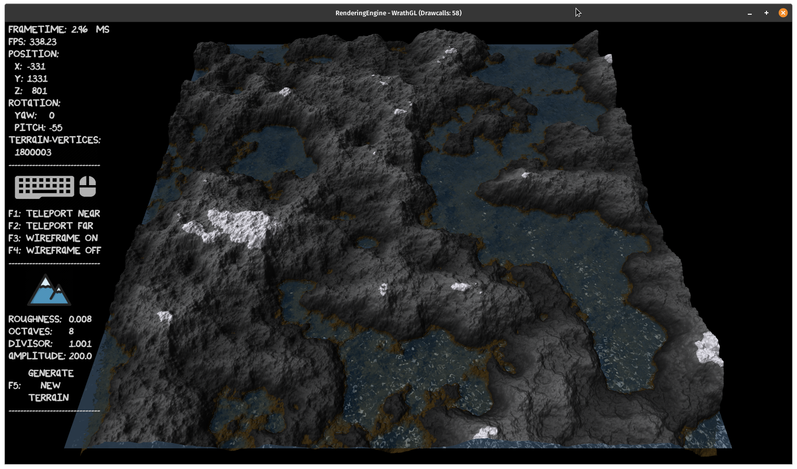
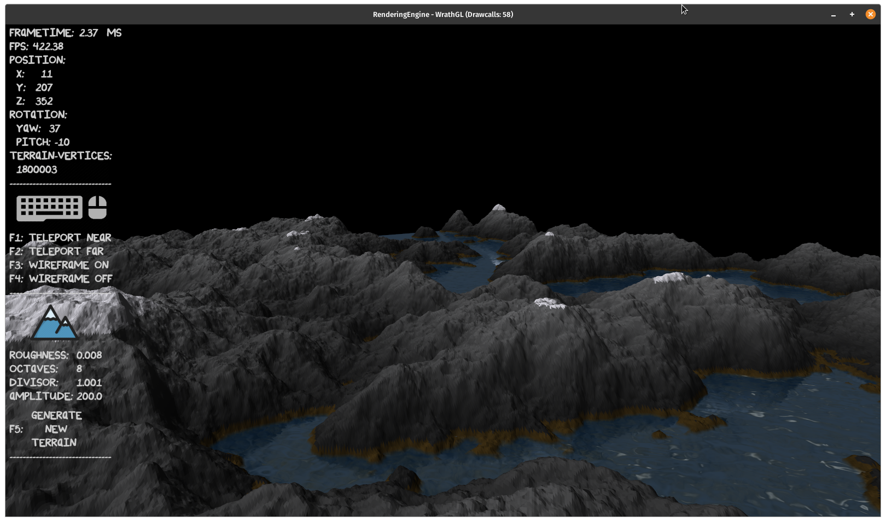

# RenderingEngine in C with OpenGL

### Objectives:
   - Simple OpenGL-Wrapper functions
      - Located in the engine-core
   - Example applications that use the wrapper functions       
      - Sandbox: Box-Picker (2D)
      - WrathGL: Terrain-Creator (3D)  
      - PowderTrain: Falling-Sand-Simulation (2D)
   - Written entirely in C

### General functionalities
   - Basic OpenGL-Wrapping (VAO, VBO, IBO, Shader, Texture, Errorhandling)  (X)  
   - Windowcreation for 2D and 3D (X)
   - 2D Sprite-Renderer (X)
   - Text rendering (X)
      - Batch rendering system (X)
   - OBJ-Loading
   - Camerasystem (X)
   - Audiomanager for sounds and backgroundmusic        

### Example applications   
   #### Sandbox App (2D)
      - GUI (X)
      - Box picking and placing (X)
         - Instanced rendering (X)
      - 2D Physics (X)
      - Liquids   
      - AI
   #### WrathGL App (3D)            
      - 3D Mesh creation (planes, tiles) (X)
      - Terrain creation (X)
         - Vertices (X)
            - Procedural generated with noise-function (X)
            - Dynamic, changeable and controllable
            - Backgroundthread calculates new terrain (X)
            - Renderthread renders new terrain (X)
         - Colors (X)
            - Dynamic, based on height (X)
         - Lighting (X)
      - Water (X)
   #### PowderTrain App (2D)
      - Pixel-Renderer
      - Sand-Simulation
         - Different materials/substances -> different reactions
      - GUI   

### Credits
   - [SDL2](https://www.libsdl.org/index.php)
   - [log.c](https://github.com/rxi/log.c)
   - [stb_image](https://github.com/nothings/stb/blob/master/stb_image.h)
   - [cglm](https://github.com/recp/cglm)
   - [glad](https://github.com/Dav1dde/glad)
   - [FreeType](https://freetype.org/index.html)
   - [Chipmunk2D](https://github.com/slembcke/Chipmunk2D)
   - [GLFW](https://github.com/glfw/glfw) 

### Using & Compiling
   - Currently only for linux
   - There will be a guide on how to build the engine or a script that does everything for you, when it's a bit more matured
   - For now:   
      - Clone the repository
      - Install the dependencies (SDL2, cglm, FreeType, Chipmunk2D, GLFW) 
         - Take a look at the credits to find the repositories
      - Execute one of the shell scripts or the Makefile itself to build the demo applications
      - Run the demo applications  

### License
   - This code is provided under a BSD-style license. See the file LICENSE for details

### Structure of the example application "Sandbox"
   - To show the collaboration of the different modules
   - Just for visualization purposes, not UML conform    

   

### Look of the Sandbox App
   

### Look of the WrathGL App
   
   

### Look of the PowerTrain App
   - Coming soon!   